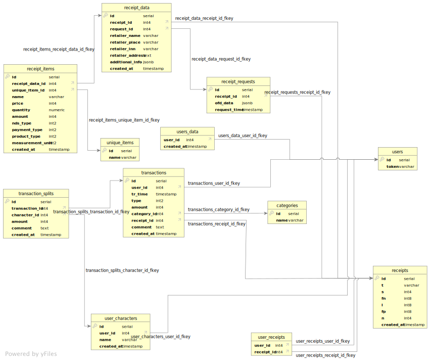
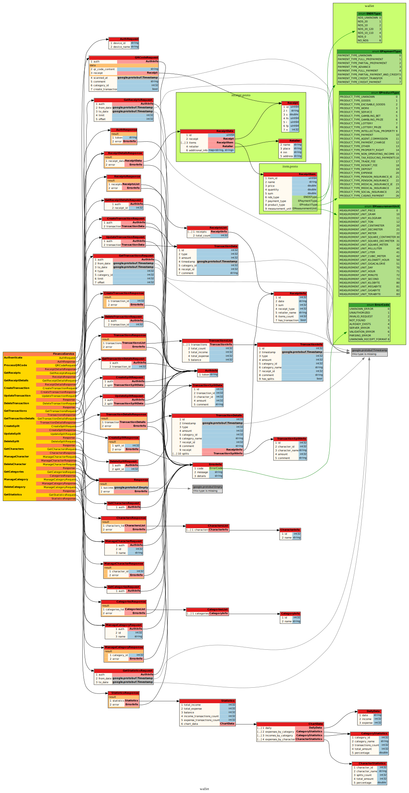

[](https://github.com/HappyNano/spbstu-wallet/actions/workflows/build-backend-workflow.yml)
[](https://github.com/HappyNano/spbstu-wallet/actions/workflows/build-android-workflow.yml)
[](https://github.com/HappyNano/spbstu-wallet/actions/workflows/tests-backend.yml)
[](https://github.com/HappyNano/spbstu-wallet/actions/workflows/doxygen-docs.yml)

# Установка

## Установка пакетов, vcpkg, android-sdk

Поддерживаемые версии clang-format и clang-tidy 19+ \
Gradle неоходим версии 8+

```bash
sudo apt update
sudo apt install -y \
  build-essential curl zip unzip tar pkg-config git ninja-build \ 
  cmake g++ clang-format clang-tidy python3-pip bison flex autoconf ca-certificates

# Installing vcpkg
wget -O vcpkg.tar.gz https://github.com/microsoft/vcpkg/archive/refs/tags/2025.02.14.tar.gz
mkdir ~/vcpkg
tar xf vcpkg.tar.gz --strip-components=1 -C ~/vcpkg
~/vcpkg/bootstrap-vcpkg.sh
sudo ln -s ~/vcpkg/vcpkg /usr/local/bin/vcpkg
rm -rf vcpkg.tar.gz

# Installing android-sdk ndk
sudo apt install -y \
    google-android-platform-34-installer \
    google-android-build-tools-34.0.0-installer \
    google-android-cmdline-tools-13.0-installer \
    google-android-ndk-r25-installer

# Installing dependencies for SDL3 build
sudo apt install libx11-dev libxft-dev libxext-dev libxi-dev libxtst-dev libwayland-dev libxkbcommon-dev libegl1-mesa-dev libibus-1.0-dev bison libxrandr-dev -y
```

## Установка переменных среды

```bash
export ANDROID_NDK_HOME=/usr/lib/android-ndk/
export VCPKG_ROOT=$HOME/vcpkg
export PATH=$PATH:$VCPKG_ROOT
```

## Установка pre-commit hook

```bash
cp scripts/pre-commit/pre-commit .git/hooks/
```

### pre-commit hook:
- Проверяет staged файлы на clang-format
- Проверяет наличие новой строки в конце файла

# Сборка

## CMD

```bash
mkdir build
cmake -B build -S . \
      -DPLATFORM=BACKEND \
      -DCMAKE_BUILD_TYPE=Release \
      -DBUILD_TESTING=ON \
      -DVCPKG_TARGET_TRIPLET=x64-linux
cd build
cmake --build .
```

## VSCode

Для VSCode указан CMakePresets.json файл для сборки с помощью расширения Cmake-tools

# Используемые таблицы:

[](./docs/service/database_tables_vertical.svg)

Сгенерировано с помощью программы https://www.dbvis.com/

# Графическое представление service.proto:

[](./docs/service/proto.svg)

Сгенерировано с помощью https://github.com/seamia/protodot
